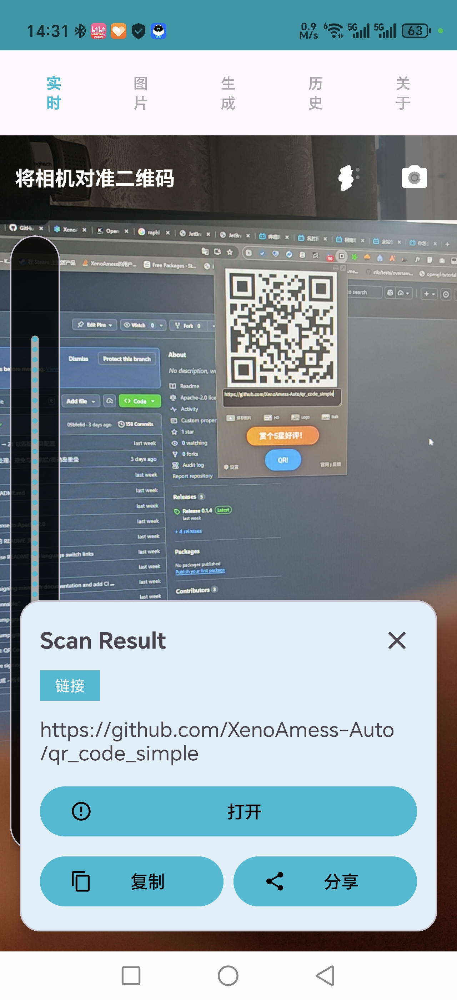
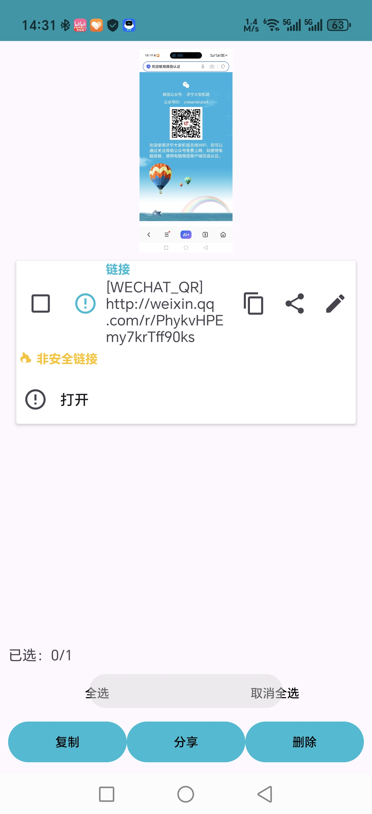
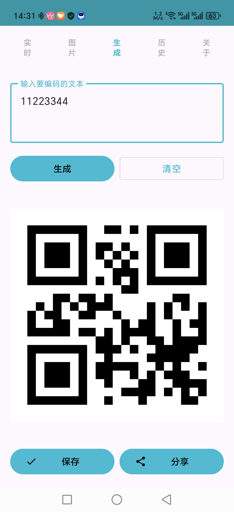
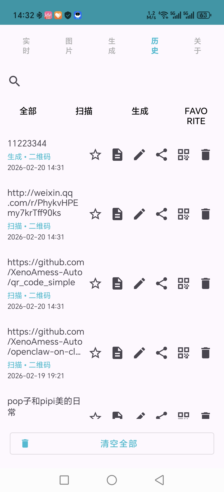

# QR Code Simple

[English](#english) | [中文](#中文)

---

<a name="english"></a>
## English

A feature-rich Android QR/Barcode scanning and generation app.

### Features

#### Core Features
- ✅ **Full Barcode Support** - QR Code, Data Matrix, Aztec, PDF417, Code 128/39/93, EAN-13/8, UPC-A/E, Codabar, ITF (13 formats)
- ✅ **Smart Content Parsing** - Auto-detect WiFi, contacts, calendar, email, URL, geo-location with one-click actions
- ✅ **Batch Generation** - Import CSV/Excel data to generate QR codes in bulk, support ZIP export
- ✅ **Style Customization** - Foreground/background colors, center logo, rounded/dot styles
- ✅ **QR Code Repair** - Smart repair for blurry/damaged QR codes

#### History Management
- ✅ **Full-text Search** - Search by content/time/type
- ✅ **Smart Categories** - Auto-classify into links, text, WiFi, contacts, etc.
- ✅ **Favorites/Pinning** - Mark important items
- ✅ **Tag System** - Custom tag management
- ✅ **Import/Export** - JSON/CSV backup

#### Scanning Experience
- ✅ **Continuous Scan Mode** - Scan multiple codes without confirmation
- ✅ **Scan Feedback** - Vibration effects
- ✅ **Smart/Manual Focus** - Auto-adjust based on code size, tap to focus
- ✅ **Scan Area Limit** - Recognize within selected region

#### Share & Export
- ✅ **Vector Export** - SVG format QR code export (lossless scaling)
- ✅ **Share Templates** - Generate share images with description text

#### Security & Privacy
- ✅ **Malicious Link Detection** - Local blacklist, URL suspicious feature analysis
- ✅ **Privacy Mode** - Incognito scanning (no history saved)
- ✅ **App Lock** - Fingerprint/password protection for sensitive history
- ✅ **Local Encryption** - SQLCipher AES-256 database encryption

#### UI & UX
- ✅ **Material You** - Android 12+ dynamic colors
- ✅ **Landscape Support** - Optimized for tablets and landscape
- ✅ **Shortcuts** - Long-press icon for quick scan/generate
- ✅ **Home Widgets** - Quick scan/generate widgets
- ✅ **Animation** - Page transitions, scan line animation
- ✅ **Internationalization** - Simplified Chinese, Traditional Chinese, English, Japanese, Korean, German

#### Technical
- ✅ **Unit Tests** - Comprehensive test coverage
- ✅ **Performance** - Large image loading memory optimization
- ✅ **Crash Monitoring** - Firebase Crashlytics integration
- ✅ **Offline Enhancement** - TensorFlow Lite model support

### Screenshots

| Live Scan Result | Image Scan |
|:----------------:|:----------:|
|  |  |

| QR Generation | History Management |
|:-------------:|:------------------:|
|  |  |

### Tech Stack

- **Language**: Kotlin
- **UI**: Jetpack Compose / XML Layout
- **Database**: Room + SQLCipher (encrypted)
- **DI**: Singleton pattern
- **Async**: Kotlin Coroutines
- **Camera**: CameraX
- **QR Recognition**: ZXing + ML Kit + WeChatQRCode
- **ML**: TensorFlow Lite
- **Crash Monitoring**: Firebase Crashlytics

### Build Requirements

- Android Studio Hedgehog (2023.1.1) or higher
- JDK 17
- Android SDK 34
- Gradle 8.2

### Build Instructions

```bash
# Clone
git clone https://github.com/XenoAmess-Auto/qr_code_simple.git
cd qr_code_simple

# Build Debug
./gradlew assembleDebug

# Run tests
./gradlew test

# Install to device
./gradlew installDebug
```

### Project Structure

```
app/src/main/java/com/xenoamess/qrcodesimple/
├── MainActivity.kt              # Main activity
├── QRCodeApp.kt                 # Application class
├── data/                        # Data layer
│   ├── AppDatabase.kt           # Encrypted database
│   ├── HistoryItem.kt           # History entity
│   ├── HistoryDao.kt            # Database access
│   └── HistoryRepository.kt     # Data repository
├── ui/                          # UI components
│   ├── CameraScanFragment.kt    # Real-time scan
│   ├── ScanImageActivity.kt     # Image scan
│   ├── GenerateActivity.kt      # QR generation
│   └── HistoryFragment.kt       # History
└── util/                        # Utils
    ├── BarcodeGenerator.kt      # Barcode generator
    ├── ContentParser.kt         # Content parser
    ├── QRCodeScanner.kt         # QR scanner
    └── LocaleHelper.kt          # Language helper
```

### License

MIT License

### Contributing

Issues and Pull Requests welcome!

---

<a name="中文"></a>
## 中文

一款功能丰富的 Android 二维码/条码扫描与生成应用。

### 功能特性

#### 核心功能
- ✅ **全条码支持** - 支持 QR Code、Data Matrix、Aztec、PDF417、Code 128/39/93、EAN-13/8、UPC-A/E、Codabar、ITF 等 13 种格式
- ✅ **智能内容解析** - 自动识别 WiFi、联系人、日历、邮件、URL、地理位置等格式，提供一键操作
- ✅ **批量生成** - 从 CSV/Excel 导入数据批量生成二维码，支持 ZIP 导出
- ✅ **样式定制** - 前景色/背景色自定义、中心 Logo、圆角/点阵样式
- ✅ **二维码修复** - 对模糊/破损二维码进行智能修复识别

#### 历史记录
- ✅ **全文搜索** - 按内容/时间/类型搜索历史
- ✅ **智能分类** - 自动归类为链接、文本、WiFi、联系人等
- ✅ **收藏/置顶** - 重要内容标记
- ✅ **标签系统** - 自定义标签管理
- ✅ **导入/导出** - JSON/CSV 格式备份

#### 扫描体验
- ✅ **连续扫描模式** - 无需确认连续扫描多个码
- ✅ **扫描反馈** - 震动效果
- ✅ **智能/手动对焦** - 根据码大小自动调整对焦距离，支持点击对焦
- ✅ **扫描区域限定** - 框选特定区域识别

#### 分享与导出
- ✅ **矢量导出** - SVG 格式二维码导出（无损放大）
- ✅ **分享模板** - 生成带说明文字的分享图片

#### 安全与隐私
- ✅ **恶意链接检测** - 本地黑名单检测、URL 可疑特征分析
- ✅ **隐私模式** - 无痕扫描（不保存历史）
- ✅ **应用锁** - 指纹/密码保护敏感历史
- ✅ **本地加密** - SQLCipher AES-256 数据库加密

#### 界面与体验
- ✅ **Material You** - Android 12+ 动态取色
- ✅ **横屏适配** - 平板和横屏优化布局
- ✅ **快捷方式** - 长按图标快速扫码/生成
- ✅ **桌面小组件** - 快速扫描/生成小组件
- ✅ **动画优化** - 页面过渡、扫描线动画
- ✅ **国际化** - 支持简体中文、繁体中文、英语、日语、韩语、德语

#### 技术特性
- ✅ **单元测试** - 全面的单元测试覆盖
- ✅ **性能优化** - 大图加载内存优化
- ✅ **崩溃监控** - Firebase Crashlytics 集成
- ✅ **离线增强** - TensorFlow Lite 模型支持

### 使用效果图

| 实时扫描结果 | 图片扫描识别 |
|:------------:|:------------:|
|  |  |

| 二维码生成 | 历史记录管理 |
|:----------:|:------------:|
|  |  |

### 技术栈

- **语言**: Kotlin
- **UI**: Jetpack Compose / XML Layout
- **数据库**: Room + SQLCipher（加密）
- **依赖注入**: 无（使用单例模式）
- **异步**: Kotlin Coroutines
- **相机**: CameraX
- **二维码识别**: ZXing + ML Kit + WeChatQRCode
- **机器学习**: TensorFlow Lite
- **崩溃监控**: Firebase Crashlytics

### 构建要求

- Android Studio Hedgehog (2023.1.1) 或更高版本
- JDK 17
- Android SDK 34
- Gradle 8.2

### 构建说明

```bash
# 克隆项目
git clone https://github.com/XenoAmess-Auto/qr_code_simple.git

# 进入项目目录
cd qr_code_simple

# 构建 Debug 版本
./gradlew assembleDebug

# 运行单元测试
./gradlew test

# 安装到设备
./gradlew installDebug
```

### 项目结构

```
app/src/main/java/com/xenoamess/qrcodesimple/
├── MainActivity.kt              # 主界面
├── QRCodeApp.kt                 # Application 类
├── data/                        # 数据层
│   ├── AppDatabase.kt           # 加密数据库
│   ├── HistoryItem.kt           # 历史记录实体
│   ├── HistoryDao.kt            # 数据库访问
│   └── HistoryRepository.kt     # 数据仓库
├── ui/                          # UI 组件
│   ├── CameraScanFragment.kt    # 实时扫描
│   ├── ScanImageActivity.kt     # 图片扫描
│   ├── GenerateActivity.kt      # 二维码生成
│   └── HistoryFragment.kt       # 历史记录
└── util/                        # 工具类
    ├── BarcodeGenerator.kt      # 条码生成器
    ├── ContentParser.kt         # 内容解析器
    ├── QRCodeScanner.kt         # 二维码扫描器
    └── LocaleHelper.kt          # 语言切换助手
```

### 开源许可

MIT License

### 贡献

欢迎提交 Issue 和 Pull Request！

---

## Acknowledgments / 致谢

- [ZXing](https://github.com/zxing/zxing) - QR code recognition
- [ML Kit](https://developers.google.com/ml-kit) - Google ML suite
- [WeChatQRCode](https://github.com/WeChatCV/opencv_3rdparty) - WeChat QR engine
- [SQLCipher](https://www.zetetic.net/sqlcipher/) - Database encryption
- [TensorFlow Lite](https://www.tensorflow.org/lite) - On-device ML
