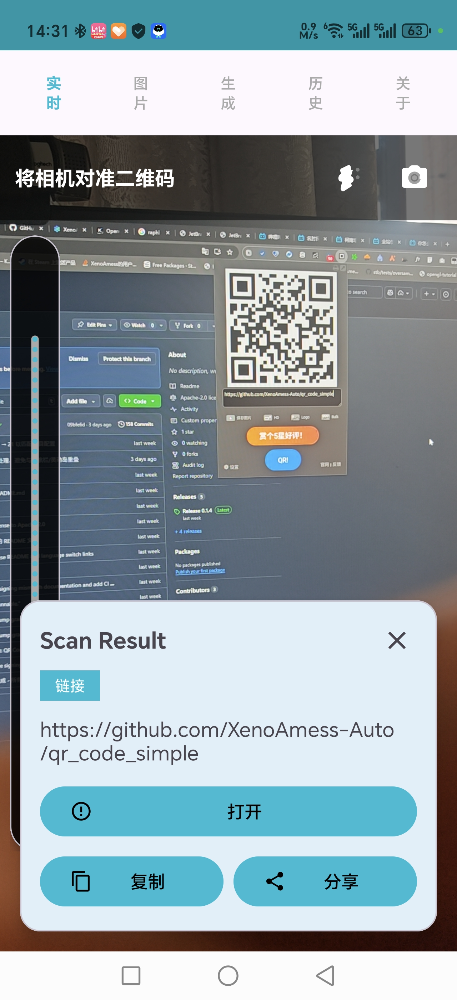
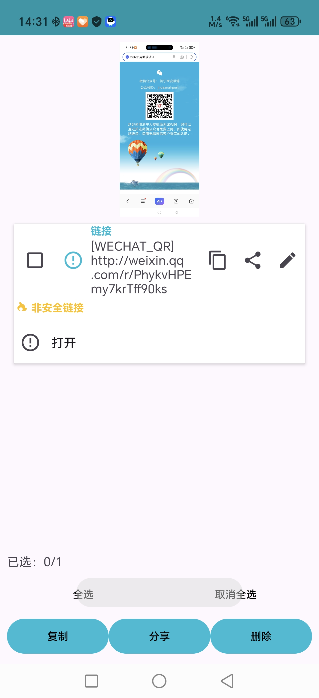
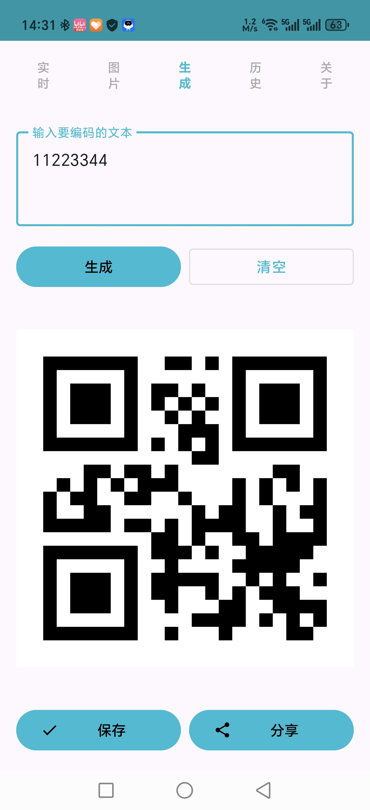
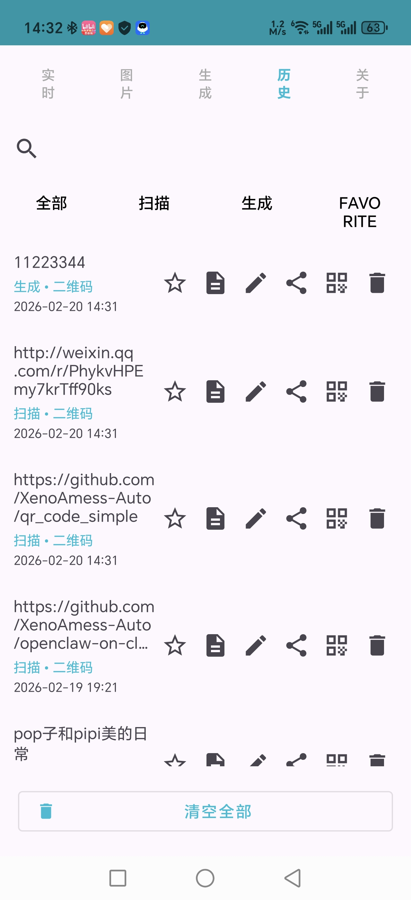

# QR Code Simple

[English](README.md) | [中文](README_CN.md)

[](https://xenoamess-auto.github.io/qr_code_simple/coverage.html)

A feature-rich Android QR/Barcode scanning and generation app.

---

## Features

### Core

- ✅ **50+ Barcode Formats** - Scan and generate QR Code, Data Matrix (including Chinese/UTF-8), Aztec, PDF417, Han Xin Code (汉信码), MaxiCode, Micro QR, Code 128/39/93, EAN-13/8, UPC-A/E, Codabar, ITF, Pharmacode, Plessey, MSI Plessey, Telepen, RSS-14, RSS Expanded, UPC/EAN Extension, and many more OkapiBarcode-only generate-only formats (Code 2 of 5 variants, postal codes, Codablock F, Grid Matrix, Code One, etc.).
- ✅ **Smart Content Parsing** - Auto-detect WiFi, contacts, calendar, email, URLs, and geo-location with one-tap actions.
- ✅ **Batch Generation** - Import CSV or Excel data and generate barcodes in bulk, with ZIP export.
- ✅ **Style Customization** - Foreground/background colors, multi-stop gradients, center logo, module shapes (square/circle/rounded), position patterns, corner radius, and error correction levels.
- ✅ **QR Code Repair** - Automatic restoration retry for blurry or low-contrast codes (grayscale / contrast / binarization variants).

### History

- ✅ **Full-text Search** - Search by content, time, or type.
- ✅ **Smart Categories** - Auto-classify into links, text, WiFi, contacts, and more.
- ✅ **Favorites / Pinning** - Mark important items.
- ✅ **Tag System** - Custom tag management.
- ✅ **Import / Export** - JSON / CSV backup, plus optional password-encrypted backups (AES-256-GCM + PBKDF2).
- ✅ **Retention Policy** - Auto-delete history older than 30 / 90 / 365 days (favorites are kept).

### Scanning Experience

- ✅ **Continuous Scan Mode** - Scan multiple codes without confirmation dialogs.
- ✅ **Haptic Feedback** - Vibration on successful decode.
- ✅ **Auto / Tap-to-focus** - Adapts to code size; tap to focus manually.
- ✅ **Scan Region Limit** - Toggle region mode and drag to decode only within the selected area.
- ✅ **Video Scan** - Decode barcodes directly from video files.
- ✅ **Share to Scan** - Share images or videos from any app straight into the scanner (gallery, file manager, etc.).

### Share & Export

- ✅ **Vector Export** - SVG format for lossless scaling.
- ✅ **Share Templates** - Generate share images with description text.
- ✅ **Share to Generate** - Share plain text from any app to prefill and generate a code instantly.

### Security & Privacy

- ✅ **Malicious Link Detection** - Local blacklist + URL suspicious-feature analysis, with an optional (default-off) silent online blacklist update.
- ✅ **Privacy Mode** - Incognito scanning; nothing is written to history.
- ✅ **App Lock** - Fingerprint or password protection for sensitive history.
- ✅ **Local Encryption** - SQLCipher (AES-256) on the history database.

> **Privacy note**: The only network permission (`INTERNET`) is used solely by the optional, default-off blacklist update. Everything else works fully offline.

### UI & UX

- ✅ **Material You** - Android 12+ dynamic colors.
- ✅ **Landscape Support** - Tablet and landscape optimized.
- ✅ **Shortcuts** - Long-press the launcher icon to scan or generate.
- ✅ **Quick Settings Tile** - One-tap camera scan from the notification shade.
- ✅ **Home Widgets** - Quick Scan and Quick Generate widgets.
- ✅ **Internationalization** - Simplified Chinese, English, Japanese, Korean, German.
- ✅ **Animation** - Page transitions and scan-line animation.

### Technical

- ✅ **Unit Tests** - Roundtrip tests for every scannable format and generation tests for every generate-only format (Robolectric).
- ✅ **Memory-aware Image Loading** - Large image handling.

---

## Supported Barcode Formats

The app supports **50+ barcode formats** for generation, with the scannable subset able to roundtrip through the app's own scanner.

### 2D Matrix Codes

| Format | Scan | Generate | Description |
|--------|:----:|:--------:|-------------|
| **QR Code** | ✅ | ✅ | Most common 2D code; widely used for payments, URLs, and contact sharing. |
| **Data Matrix** | ✅ | ✅ | Compact 2D code for very small spaces; supports UTF-8 / Chinese content via ECI. |
| **Aztec Code** | ✅ | ✅ | 2D code with no required quiet zone; often used on train tickets and boarding passes. |
| **PDF417** | ✅ | ✅ | Stacked linear barcode capable of holding large text and binary payloads; used on IDs and shipping labels. |
| **MaxiCode** | ✅ | ✅ | Fixed-size 2D code developed by UPS; used in international logistics and air freight. |
| **Micro QR Code** | ✅ | ✅ | Miniaturized QR code for extremely small marking spaces. |
| **Han Xin Code** | ✅ | ✅ | Chinese 2D matrix code (GB/T 36527); supports Chinese characters and ECI. The in-app display name is `Han Xin`. |
| **Swiss QR Code** | - | ✅ | QR-bill format used for Swiss payment slips. |
| **UPN QR Code** | - | ✅ | Slovenian Universal Payment Order QR format. |
| **Aztec Rune** | - | ✅ | Small fixed-size Aztec symbol carrying a numeric message (0-255). |
| **Code One** | - | ✅ | 2D matrix code family; generate-only due to OkapiBarcode encoder limitations. |
| **Grid Matrix** | - | ✅ | Chinese 2D matrix code; requires at least one non-ASCII character (usually Chinese). |

### 1D / Linear Barcodes

| Format | Scan | Generate | Description |
|--------|:----:|:--------:|-------------|
| **Code 128** | ✅ | ✅ | High-density alphanumeric encoding; widely used in logistics and supply chain. |
| **Code 39** | ✅ | ✅ | Digits, uppercase letters, and a few symbols; common in industrial and military use. |
| **Code 39 Extended** | - | ✅ | Full ASCII version of Code 39. |
| **Code 93** | ✅ | ✅ | Compact improvement over Code 39; common in logistics and industry. |
| **EAN-13** | ✅ | ✅ | 13-digit European Article Number; the standard retail barcode in most countries. |
| **EAN-8** | ✅ | ✅ | Short form of EAN-13 for small packaging. |
| **UPC-A** | ✅ | ✅ | 12-digit Universal Product Code standard in North American retail. |
| **UPC-E** | ✅ | ✅ | Compressed form of UPC-A for small packages. |
| **Codabar** | ✅ | ✅ | Digits and a few symbols; historically used in libraries and blood banks. |
| **ITF** | ✅ | ✅ | Interleaved 2 of 5; numeric-only, common on carton packaging. |
| **ITF-14** | - | ✅ | 14-digit GTIN packaging variant of ITF. |
| **Code 2 of 5 Standard** | - | ✅ | Standard Interleaved 2 of 5. |
| **Code 2 of 5 Matrix** | - | ✅ | Matrix variant of Code 2 of 5. |
| **Code 2 of 5 Industrial** | - | ✅ | Industrial variant of Code 2 of 5. |
| **Code 2 of 5 IATA** | - | ✅ | IATA variant of Code 2 of 5. |
| **Code 2 of 5 Datalogic** | - | ✅ | Datalogic variant of Code 2 of 5. |
| **Code 2 of 5 Deutsche Post Leitcode** | - | ✅ | Deutsche Post Leitcode (max 13 digits). |
| **Code 2 of 5 Deutsche Post Identcode** | - | ✅ | Deutsche Post Identcode (max 11 digits). |
| **Code 11** | - | ✅ | Digits and hyphens; telecommunications. |
| **Code 16K** | - | ✅ | 2D stacked barcode similar to Code 49. |
| **Code 32** | - | ✅ | Italian pharmaceutical code (up to 8 digits). |
| **Code 49** | - | ✅ | 2D stacked barcode. |
| **Codablock F** | - | ✅ | Multi-row stacked barcode. |
| **Channel Code** | - | ✅ | High-density numeric channel code. |
| **LOGMARS** | - | ✅ | DOD LOGMARS variant of Code 39. |
| **NVE-18** | - | ✅ | Nummer der Versandeinheit (18 characters). |
| **DPD Code** | - | ✅ | DPD parcel routing code (27-28 characters). |
| **Pharmacode** | ✅ | ✅ | One-dimensional code designed for pharmaceutical packaging (numeric, 3 - 131070). |
| **Pharmacode Two-Track** | - | ✅ | Two-track variant of Pharmacode. |
| **Pharmazentralnummer** | - | ✅ | German/Austrian PZN (up to 7 digits). |
| **Plessey Code** | ✅ | ✅ | Common in libraries and inventory management. |
| **MSI Plessey** | ✅ | ✅ | Variant of Plessey; common in libraries and inventory management. |
| **Telepen** | ✅ | ✅ | Common in libraries and academic institutions. |
| **Telepen Numeric** | - | ✅ | Numeric-only variant of Telepen. |
| **EAN/UPC Add-On** | - | ✅ | 2-5 digit supplementary code for EAN/UPC. |

### UPC/EAN Extension and GS1 DataBar

| Format | Scan | Generate | Description |
|--------|:----:|:--------:|-------------|
| **UPC/EAN Extension** | ✅¹ | ✅ | 2- or 5-digit add-on for UPC/EAN. |
| **RSS-14 / GS1 DataBar** | ✅ | ✅ | GS1 standard barcode designed to replace traditional UPC/EAN in retail. |
| **RSS Expanded** | ✅ | ✅ | Variable-length alphanumeric GS1 barcode for batch, weight, and similar attributes. |
| **GS1 DataBar Limited** | - | ✅ | Limited-capacity GS1 DataBar. |
| **Composite** | - | ✅ | Composite barcode combining a linear and a 2D component; content must be GS1. |

¹ The UPC/EAN Extension **cannot be scanned standalone**. The generator attaches it to a dummy EAN-13, and the extension value comes back via ZXing's `ResultMetadataType.UPC_EAN_EXTENSION` rather than as a primary decode.

### Postal Codes

| Format | Scan | Generate | Description |
|--------|:----:|:--------:|-------------|
| **Postnet** | - | ✅ | USPS POSTNET barcode. |
| **Royal Mail 4-State** | - | ✅ | Royal Mail 4-State customer code. |
| **USPS OneCode** | - | ✅ | USPS Intelligent Mail barcode. |
| **USPS Package** | - | ✅ | USPS Package IMpb (GS1-128 based). |
| **Japan Post** | - | ✅ | Japan Post barcode. |
| **KIX Code** | - | ✅ | Dutch KIX postal code. |
| **Korea Post** | - | ✅ | Korea Post barcode. |
| **Australia Post** | - | ✅ | Australia Post barcode. |

> **Generate-only formats**: Formats marked with `-` under Scan are not supported by the current scanning stack (ZXing / ML Kit / BoofCV / WeChatQR / HanXin / custom linear). The app will generate them and show a generate-only warning in the UI.

---

## Screenshots

| Live Scan Result | Image Scan |
|:----------------:|:----------:|
|  |  |

| QR Generation | History Management |
|:-------------:|:------------------:|
|  |  |

---

## Tech Stack

- **Language**: Kotlin 2.2.10
- **UI**: Jetpack Compose + XML Layouts (viewBinding)
- **Database**: Room 2.7.1 + SQLCipher 4.5.4 (encrypted)
- **Async**: Kotlin Coroutines
- **Camera**: CameraX 1.3.3
- **Barcode Recognition**: ZXing 3.5.3, ML Kit 17.2.0, WeChatQRCode 2.6.0 (OpenCV)
- **Micro QR**: BoofCV 1.4.0
- **Complex Generation**: OkapiBarcode 0.5.6 (RSS-14 / RSS Expanded / MaxiCode / Data Matrix UTF-8 / postal / 2 of 5 / Code One / Grid Matrix / ...)
- **CSV Parsing**: Apache Commons CSV 1.14.1
- **Biometric**: androidx.biometric 1.1.0
- **Tests**: JUnit 4 + Robolectric 4.16.1

The full file index and architectural notes live in [`docs/knowledge-base.md`](docs/knowledge-base.md).

---

## Build Requirements

- **JDK 21** (required by `compileOptions` and `kotlinOptions.jvmTarget = '21'`)
- **Android SDK 35** (`compileSdk 35`, `targetSdk 35`, `minSdk 28`)
- **Gradle 9.6.1** (already pinned via `gradle-wrapper.properties`)
- **Android Studio Ladybug (2024.2.1) or newer** - AGP 9.2.1 will not load in older IDEs
- **NDK** is **not** required to build; only the native libraries shipped through the WeChatQRCode / OpenCV AARs are used

Set `JAVA_HOME` to your JDK 21 install and put `sdk.dir=/path/to/Android/Sdk` into `local.properties`. `local.properties` is git-ignored.

---

## Build Instructions

```bash
# Clone
git clone https://github.com/XenoAmess-Auto/qr_code_simple.git
cd qr_code_simple

# Build Debug APK (use the wrapper, not a global gradle)
./gradlew :app:assembleDebug

# Run unit tests (Robolectric)
./gradlew :app:testDebugUnitTest

# Install to a connected device
./gradlew :app:installDebug
```

If you see "App not installed" or signature mismatch errors, see `README_CN.md` → "签名问题解决方案" for three workarounds (download CI debug keystore, use CI-built APK, or uninstall and reinstall).

---

## Project Structure

```
app/src/main/java/com/xenoamess/qrcodesimple/
├── MainActivity.kt                  # TabLayout + ViewPager2 entry
├── QRCodeApp.kt                     # Application class; native-lib loader
├── QRCodeScanner.kt                 # Multi-engine scanner (WeChatQRCode -> ZXing -> ML Kit -> BoofCV -> HanXin -> custom)
├── BarcodeGenerator.kt              # Barcode generation entry
├── AdvancedBarcodeGenerator.kt      # Styled generation (colors, logos, shapes)
├── BarcodeFormatAdapter.kt          # Format dropdown adapter for the generate UI
├── BarcodeFormatUtils.kt            # Format utilities, localized names and validation helpers
├── BarcodeLayout.kt                 # Layout abstraction for styled barcode rendering (Grid / Linear / MaxiCode / Fallback)
├── StyleConfigSerialization.kt      # JSON serialization / deserialization for style configs
├── SvgQRCodeGenerator.kt            # SVG (vector) export
├── ShareTemplateGenerator.kt        # Share-image composition
├── ContentParser.kt                 # Plain-text -> WiFi / contact / URL / event / geo parsing
├── ContentActionHandler.kt          # Action dispatcher for parsed content
├── LocaleHelper.kt                  # Language switching helper
│
├── CameraScanActivity.kt            # Live camera scan UI
├── CameraScanFragment.kt            # Live camera scan logic
├── ScanImageActivity.kt             # Static-image scan UI + share target (image/video)
├── ScanImageFragment.kt             # Static-image scan logic
├── ScanImageProcessor.kt            # Shared image/video scan routing
├── ContinuousScanActivity.kt        # Continuous (batch) scan mode
├── ContinuousScanAdapter.kt         # List adapter for continuous scan
├── VideoScanActivity.kt             # Decode barcodes from video files
├── GenerateActivity.kt              # Single-code generation UI + share target (text)
├── GenerateFragment.kt              # Single-code generation logic
├── BatchGenerateActivity.kt         # CSV / Excel batch generation UI
├── BatchResultActivity.kt           # Batch results screen
├── BatchGenerator.kt                # CSV / Excel parsing + bulk generation
├── ResultActivity.kt                # Single-code result screen (action menu)
├── ui/result/QRResultAdapter.kt     # RecyclerView adapter for multiple scan results
├── HistoryFragment.kt               # History list
├── HistoryDetailActivity.kt         # History record detail
├── HistoryAdapter.kt                # History list adapter
├── HistoryBackupManager.kt          # JSON / CSV / encrypted import & export
├── BackupCrypto.kt                  # Backup encryption (AES-256-GCM + PBKDF2)
├── TagManager.kt                    # Custom-tag CRUD
├── AboutFragment.kt                 # About / acknowledgements
│
├── AppLockManager.kt                # Biometric / PIN lock for history
├── SecurityManager.kt               # Malicious-link heuristics
├── SecurityBlacklist.kt             # Blacklist model + assets/override loading
├── BlacklistUpdater.kt              # Optional silent online blacklist update
├── PrivacySettingsActivity.kt       # Privacy mode toggle
├── DatabaseSecurityActivity.kt      # SQLCipher key rotation
├── QRCodeRestorationManager.kt      # Restoration variants (grayscale / contrast / binarization)
├── RestorationRescan.kt             # Retry orchestration when image scan finds nothing
├── ImagePerformanceManager.kt       # Large-image memory optimizer
├── CameraFocusManager.kt            # Auto / tap-to-focus
├── ScanRegionView.kt                # Region-of-interest overlay
├── ScannerOverlayView.kt            # Camera scan-line overlay
├── AnimationUtils.kt                # Shared animation helpers
├── EdgeToEdgeExt.kt                 # Edge-to-edge utilities
├── AppShortcutManager.kt            # Static + dynamic shortcuts
│
├── QuickScanWidget.kt               # Home-screen Quick Scan widget
├── QuickGenerateWidget.kt           # Home-screen Quick Generate widget
├── QuickScanTileService.kt          # Quick Settings tile for camera scan
├── BackupActivity.kt                # Backup / restore UI
│
├── data/
│   ├── AppDatabase.kt               # Room database
│   ├── BarcodeFormat.kt             # App barcode format enum (with isScannable)
│   ├── Converters.kt                # Room type converters
│   ├── HistoryDao.kt                # History DAO
│   ├── HistoryItem.kt               # History entity + HistoryType enums
│   └── HistoryRepository.kt         # Repository wrapping DAO
│
├── decoder/
│   ├── BarcodeScanUtils.kt          # Shared pre-processing helpers
│   ├── CustomLinearBarcodeScanner.kt# Dispatches to Pharmacode / Plessey / MSI Plessey / Telepen
│   ├── MicroQrCodeScanner.kt        # BoofCV-based Micro QR scanner
│   ├── PharmacodeDecoder.kt         # Pharmacode
│   ├── PlesseyDecoder.kt            # Plessey
│   ├── MsiPlesseyDecoder.kt         # MSI Plessey
│   ├── TelepenDecoder.kt            # Telepen
│   └── hanxin/
│       ├── HanXinEncoder.kt         # Han Xin Code encoder
│       └── HanXinDecoder.kt         # Han Xin Code decoder
│
└── ViewPagerAdapter.kt              # Adapter for MainActivity tab pager
```

Resources of note:

```
app/src/main/res/
├── layout/                          # XML layouts (activities + fragments + list items + widgets)
├── values/                          # Default (English) strings, colors, themes (Material 3)
├── values-de/                       # German
├── values-ja/                       # Japanese
├── values-ko/                       # Korean
├── values-zh/                       # Simplified Chinese
├── values-night/                    # Dark theme overrides
├── drawable/                        # Vector icons (flash, camera switch, etc.)
├── anim/                            # Shared animations
├── menu/                            # Toolbar menus
├── xml/                             # locales_config.xml, shortcuts.xml, widget provider info, ...
└── mipmap-*/                        # Launcher icons
```

---

## Acknowledgements

- [ZXing](https://github.com/zxing/zxing) - QR / barcode recognition fallback
- [ML Kit](https://developers.google.com/ml-kit) - Google ML barcode scanning
- [WeChatQRCode](https://github.com/WeChatCV/opencv_3rdparty) - Primary QR engine (via [jenly1314](https://github.com/jenly1314/WeChatQRCode))
- [BoofCV](https://boofcv.org/) - Micro QR Code detector
- [OkapiBarcode](https://github.com/woo-j/OkapiBarcode) - Generation for RSS-14 / RSS Expanded / MaxiCode / Data Matrix UTF-8 / postal codes / Code 2 of 5 / Code One / Grid Matrix / ...
- [SQLCipher](https://www.zetetic.net/sqlcipher/) - Database encryption
- [Apache Commons CSV](https://commons.apache.org/proper/commons-csv/) - CSV parsing for batch generation

---

## License

Apache License 2.0 - see [LICENSE](LICENSE).

---

## Contributing

Issues and Pull Requests are welcome. Before opening a PR, please run `./gradlew :app:testDebugUnitTest` and keep `docs/knowledge-base.md` in sync with the code.

---

## Support

If this project helps you, consider supporting development:

[](https://ko-fi.com/xenoamess)
