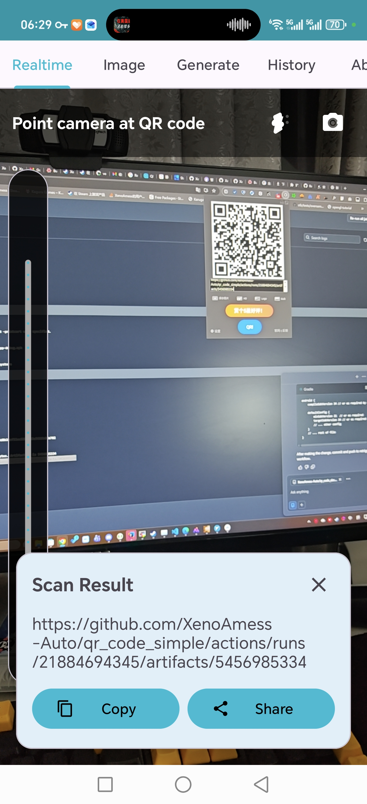
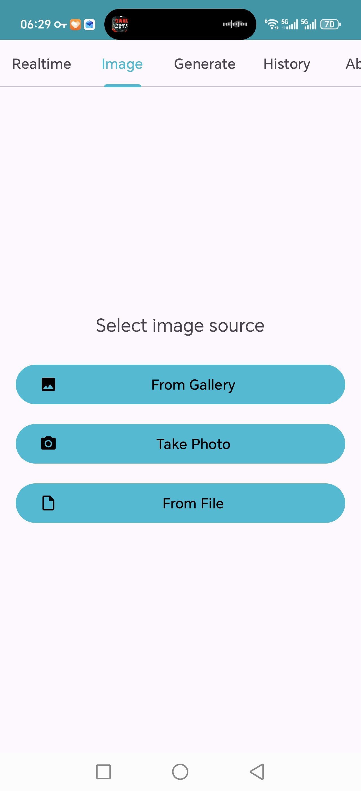
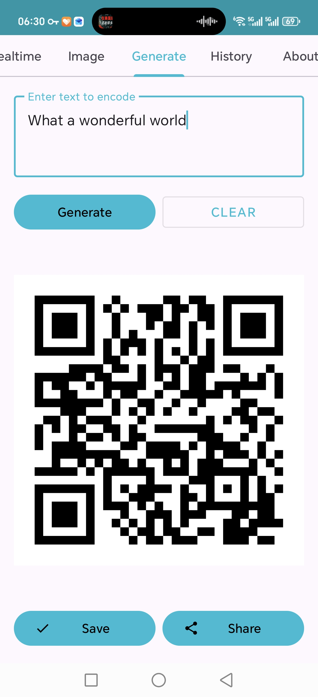
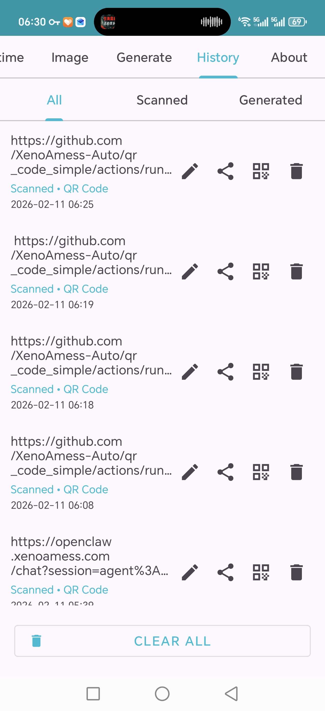

# QR Code Simple

一款简洁的 Android 二维码扫描与生成应用。

**[English](README.md) | 中文**






## 功能特性

### 1. 实时扫描 (相机)
- 实时相机预览，即时识别二维码
- **缩放滑块** - 可调节变焦（1x 到最大相机变焦）
- **闪光灯开关** - 开启/关闭手电筒
- **摄像头切换** - 前后摄像头切换
- 自动保存扫描历史

### 2. 图片扫描
- 从相册选择图片
- 从文件管理器选取图片
- 从剪贴板粘贴图片
- 单张图片多二维码识别
- 结果带绿色边框标注
- 批量操作：全选、复制、分享、删除

### 3. 生成二维码
- 输入文本生成二维码
- 复制生成的二维码到剪贴板
- 分享二维码图片

### 4. 历史记录
- 查看所有扫描和生成的二维码
- 复制历史项目
- 分享历史项目
- 删除单条或清空全部
- 从生成记录分享二维码图片

### 5. 关于
- 应用信息
- 支持开发快捷链接 (Ko-fi)
- 源代码和维护者链接

## 技术栈

- **Kotlin** - 编程语言
- **CameraX** - 相机预览和图像分析
- **ZXing** - 二维码扫描后备方案
- **ML Kit** - 条码扫描（后备方案）
- **WeChatQRCode** - 主要二维码识别引擎
- **OpenCV** - 图像处理
- **Room** - 本地历史数据库
- **Material Design 3** - UI 组件
- **ViewPager2 + TabLayout** - 导航

## 权限说明

- `CAMERA` - 用于实时扫描
- `READ_MEDIA_IMAGES` - 用于从相册选择图片

## 构建

### 环境要求
- Java 17
- Android SDK (compileSdk 34)
- Gradle 8.2

### 本地构建

```bash
export JAVA_HOME=$HOME/opt/jdk-17.0.12
export ANDROID_HOME=$HOME/opt/android-sdk
./gradlew assembleDebug --no-daemon
```

### 持续集成
GitHub Actions 在每次推送时自动构建 APK。

## 项目结构

```
app/src/main/java/com/xenoamess/qrcodesimple/
├── MainActivity.kt              # 主活动，含 TabLayout + ViewPager2
├── QRCodeApp.kt                 # 应用类
├── QRCodeScanner.kt             # 统一扫描器（WeChatQRCode + ZXing + ML Kit）
├── adapter/
│   └── HistoryAdapter.kt        # 历史列表适配器
├── data/
│   ├── HistoryDao.kt            # Room DAO
│   ├── HistoryDatabase.kt       # Room 数据库
│   ├── HistoryEntity.kt         # 历史数据实体
│   ├── HistoryRepository.kt     # 仓库模式
│   └── HistoryType.kt           # 枚举：扫描、生成
├── fragment/
│   ├── AboutFragment.kt         # 关于页面
│   ├── CameraScanFragment.kt    # 实时相机扫描
│   ├── GenerateFragment.kt      # 二维码生成
│   ├── HistoryFragment.kt       # 历史列表
│   └── ScanImageFragment.kt     # 图片扫描
└── util/
    ├── ImagePicker.kt           # 图片选择工具
    └── QRCodeGenerator.kt       # 二维码生成工具

res/
├── drawable/
│   ├── ic_flash_on.xml          # 闪光灯开启图标
│   ├── ic_flash_off.xml         # 闪光灯关闭图标
│   └── ic_switch_camera.xml     # 摄像头切换图标
├── layout/
│   ├── activity_main.xml        # 主布局（含标签页）
│   ├── fragment_camera_scan.xml # 实时扫描布局
│   ├── fragment_scan_image.xml  # 图片扫描布局
│   ├── fragment_generate.xml    # 生成布局
│   ├── fragment_history.xml     # 历史布局
│   └── fragment_about.xml       # 关于布局
└── values/
    ├── colors.xml               # 主题颜色（青色主色）
    └── themes.xml               # Material Design 3 主题
```

## 签名问题解决方案

如果安装 APK 时遇到"应用未安装"或"签名不匹配"错误：

### 方案一：下载 CI 调试密钥库
1. 前往 GitHub → Actions → 最新工作流运行
2. 下载 `debug-keystore` 产物
3. 安装到本地：
```bash
unzip debug-keystore.zip -d /tmp/
mkdir -p ~/.android
cp /tmp/debug.keystore ~/.android/debug.keystore
```

### 方案二：使用 CI 构建的 APK
从 GitHub Actions 下载 `debug-apk` 产物直接安装。

### 方案三：卸载后重装
```bash
adb uninstall com.xenoamess.qrcodesimple
adb install app-debug.apk
```

## 参与贡献

1. Fork 本仓库
2. 创建功能分支 (`git checkout -b feature/新功能`)
3. 提交更改 (`git commit -m '添加新功能'`)
4. 推送分支 (`git push origin feature/新功能`)
5. 创建 Pull Request

## 开源协议

Apache License 2.0

详见 [LICENSE](LICENSE) 文件。

## 支持开发

如果本应用对你有帮助，欢迎支持开发：

[](https://ko-fi.com/xenoamess)
